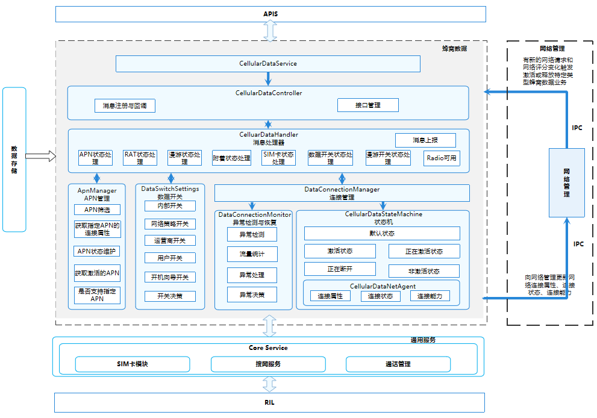

# 蜂窝数据<a name="ZH-CN_TOPIC_0000001105538940"></a>

-   [简介](#section117mcpsimp)
-   [目录](#section121mcpsimp)
-   [约束](#section125mcpsimp)
-   [接口说明](#section131mcpsimp)
-   [使用说明](#section160mcpsimp)
    -   [获取蜂窝数据开关是否打开](#section192mcpsimp)
    -   [获取蜂窝数据状态](#section213mcpsimp)
    - [获取蜂窝移动数据是否启用](#section234mcpsimp)
    
      [获取蜂窝数据漫游是否启用](#section255mcpsimp)
    
-   [相关仓](#section234mcpsimp)

## 简介<a name="section117mcpsimp"></a>

蜂窝数据模块作为电话子系统可裁剪部件，依赖于core\_service核心服务、ril\_adapter。 具有蜂窝数据激活、蜂窝数据异常检测与恢复、蜂窝数据状态管理、蜂窝数据开关管理、蜂窝数据漫游管理、APN管理、网络管理交互等功能。

**图 1**  蜂窝数据模块架构图<a name="fig332493822512"></a>


## 目录<a name="section121mcpsimp"></a>

```
base/telephony/cellular_data/
├── figures                              # Readme资源文件
├── frameworks                           # 框架层目录
│   ├── js                               # js相关代码
│   └── native                           # native相关代码
├── interfaces                           # 接口目录
│   ├── innerkits                        # 部件间的内部接口
│   └── kits                             # 对应用提供的接口（例如JS接口）
├── sa_profile                           # SA配置
├── services                             # 蜂窝数据服务代码目录
│   ├── include                          # 蜂窝数据服务头文件目录
│   └── src                              # 蜂窝数据服务实现代码目录
│       ├── apn_manager                  # APN管理代码目录
│       ├── state_machine                # 数据连接状态机代码目录
│       └── utils                        # 蜂窝数据工具代码目录
└── test                                 # 蜂窝数据测试代码目录
    └── unit_test                        # 单元测试相关代码
```

## 约束<a name="section125mcpsimp"></a>

-   开发语言：Java Script。
-   软件上，需要与以下服务配合使用：Telephony核心服务（core\_service）、RIL适配（ril\_adapter）。
-   硬件上，需要搭载的设备支持以下硬件：可以进行独立蜂窝通信的Modem以及SIM卡。

## 接口说明<a name="section131mcpsimp"></a>

**表 1**  蜂窝数据对外提供的接口

<a name="table133mcpsimp"></a>

| 接口名称                                                     | 接口描述                                                     | 所需权限                         |
| ------------------------------------------------------------ | ------------------------------------------------------------ | -------------------------------- |
| function isCellularDataEnabled(callback: AsyncCallback\<boolean>): void; | 获取蜂窝数据开关是否打开                                     | ohos.permission.GET_NETWORK_INFO |
| function getCellularDataState(callback: AsyncCallback\<DataConnectState>): void; | 获取蜂窝数据状态                                             | ohos.permission.GET_NETWORK_INFO |
| function isCellularDataEnabledSync(): boolean;               | 获取蜂窝移动数据服务是否启用                                 | ohos.permission.GET_NETWORK_INFO |
| function isCellularDataRoamingEnabledSync(slotId: number): boolean; | 获取蜂窝数据漫游服务是否启用（参数slotId为SIM卡id，0表示卡一，1表示卡二） | ohos.permission.GET_NETWORK_INFO |

完整的JS API说明以及实例代码请参考：[蜂窝数据](https://gitee.com/openharmony/docs/blob/master/zh-cn/application-dev/reference/apis-telephony-kit/js-apis-telephony-data.md)。

## 使用说明<a name="section160mcpsimp"></a>

### 获取蜂窝数据开关是否打开<a name="section192mcpsimp"></a>

1.  可以通过callback或者Promise的方式调用isCellularDataEnabled获取蜂窝数据开关是否打开。
2.  该接口为异步接口，相关执行结果会从callback中返回。

    ```
    import data from "@ohos.telephony.data";
    
    // 调用接口【callback方式】
    data.isCellularDataEnabled((err, value) => {
      if (err) {
        // 接口调用失败，err非空
        console.error(`failed to isCellularDataEnabled because ${err.message}`);
        return;
      }
      // 接口调用成功，err为空
      console.log(`success to isCellularDataEnabled: ${value}`);
    });
    
    // 调用接口【Promise方式】
    let promise = data.isCellularDataEnabled();
    promise.then((value) => {
      // 接口调用成功，此处可以实现成功场景分支代码。
      console.log(`success to isCellularDataEnabled: ${value}`);
    }).catch((err) => {
      // 接口调用失败，此处可以实现失败场景分支代码。
      console.error(`failed to isCellularDataEnabled because ${err.message}`);
    });
    ```

### 获取蜂窝移动数据服务是否启用<a name="section234mcpsimp"></a>

1.  可以通过调用isCellularDataEnabledSync获取蜂窝移动数据服务是否启用。
2.  该接口为同步接口，相关执行结果会从isCellularDataEnabledSync中返回。

    ```
    import data from "@ohos.telephony.data";
    
    try {
    	// 调用接口【Sync方式】
    	let isEnabled: boolean = data.isCellularDataEnabledSync();
    	// 调用接口成功
        console.log(`isCellularDataEnabledSync success : ${isEnabled}`);
    } catch (error) {
    	// 调用接口失败
        console.log(`isCellularDataEnabledSync failed`);  
    }
    ```

### 获取蜂窝数据漫游服务是否启用<a name="section255mcpsimp"></a>

1.  可以通过调用isCellularDataRoamingEnabledSync获取蜂窝数据漫游服务是否启用。
2.  该接口为同步接口，相关执行结果会从isCellularDataRoamingEnabledSync中返回。

    ```
    import data from "@ohos.telephony.data";
    
    try {
    	// 调用接口【Sync方式】
    	let isEnabled: boolean = data.isCellularDataRoamingEnabledSync(0);
    	// 调用接口成功
        console.log(`isCellularDataRoamingEnabledSync success : ${isEnabled}`);
    } catch (error) {
    	// 调用接口失败
        console.log(`isCellularDataRoamingEnabledSync failed`);  
    }    
    ```

### 获取蜂窝数据状态<a name="section213mcpsimp"></a>

**表 2**  DataConnectState枚举值

<a name="table21531410101919"></a>

| 名称                    | 值   | 说明     |
| ----------------------- | ---- | -------- |
| DATA_STATE_UNKNOWN      | -1   | 未知     |
| DATA_STATE_DISCONNECTED | 0    | 连接断开 |
| DATA_STATE_CONNECTING   | 1    | 连接中   |
| DATA_STATE_CONNECTED    | 2    | 已连接   |
| DATA_STATE_SUSPENDED    | 3    | 已挂起   |


1.  可以通过callback或者Promise的方式调用getCellularDataState获取蜂窝数据状态。
2.  该接口为异步接口，相关执行结果会从callback中返回。

    ```
    import data from "@ohos.telephony.data";
    
    // 调用接口【callback方式】
    data.getCellularDataState((err, value) => {
      if (err) {
        // 接口调用失败，err非空
        console.error(`failed to getCellularDataState because ${err.message}`);
        return;
      }
      // 接口调用成功，err为空
      console.log(`success to getCellularDataState: ${value}`);
    });
    
    // 调用接口【Promise方式】
    let promise = data.getCellularDataState();
    promise.then((value) => {
      // 接口调用成功，此处可以实现成功场景分支代码。
      console.log(`success to getCellularDataState: ${value}`);
    }).catch((err) => {
      // 接口调用失败，此处可以实现失败场景分支代码。
      console.error(`failed to getCellularDataState because ${err.message}`);
    });
    ```

## 相关仓<a name="section234mcpsimp"></a>

[电话服务子系统](https://gitee.com/openharmony/docs/blob/master/zh-cn/readme/电话服务子系统.md)

telephony_cellular_data

[telephony_core_service](https://gitee.com/openharmony/telephony_core_service/blob/master/README_zh.md)

[telephony_ril_adapter](https://gitee.com/openharmony/telephony_ril_adapter/blob/master/README_zh.md)


---------------------------------------------
base/telephony/cellular_data/BUILD.gn:
新增
ohos_static_library("tel_cellular_data_static") {
  use_exceptions = true
  sources = [
    "$DATA_SERVICE_EXT_WRAPPER_ROOT/src/data_service_ext_wrapper.cpp",
    "$TELEPHONY_EXT_WRAPPER_ROOT/src/telephony_ext_wrapper.cpp",
    "services/src/apn_manager/apn_holder.cpp",
    "services/src/apn_manager/apn_item.cpp",
    "services/src/apn_manager/apn_manager.cpp",
    "services/src/apn_manager/connection_retry_policy.cpp",
    "services/src/cellular_data_airplane_observer.cpp",
    "services/src/cellular_data_controller.cpp",
    "services/src/cellular_data_dump_helper.cpp",
    "services/src/cellular_data_handler.cpp",
    "services/src/cellular_data_incall_observer.cpp",
    "services/src/cellular_data_rdb_observer.cpp",
    "services/src/cellular_data_roaming_observer.cpp",
    "services/src/cellular_data_service.cpp",
    "services/src/cellular_data_service_stub.cpp",
    "services/src/cellular_data_setting_observer.cpp",
    "services/src/data_connection_manager.cpp",
    "services/src/data_connection_monitor.cpp",
    "services/src/data_switch_settings.cpp",
    "services/src/sim_account_callback_proxy.cpp",
    "services/src/state_machine/activating.cpp",
    "services/src/state_machine/active.cpp",
    "services/src/state_machine/cellular_data_state_machine.cpp",
    "services/src/state_machine/default.cpp",
    "services/src/state_machine/disconnecting.cpp",
    "services/src/state_machine/inactive.cpp",
    "services/src/state_machine/incall_data_state_machine.cpp",
    "services/src/state_notification.cpp",
    "services/src/traffic_management.cpp",
    "services/src/utils/cellular_data_hisysevent.cpp",
    "services/src/utils/cellular_data_net_agent.cpp",
    "services/src/utils/cellular_data_rdb_helper.cpp",
    "services/src/utils/cellular_data_settings_rdb_helper.cpp",
    "services/src/utils/cellular_data_utils.cpp",
    "services/src/utils/net_manager_call_back.cpp",
    "services/src/utils/net_manager_tactics_call_back.cpp",
    "services/src/utils/network_search_callback.cpp",
  ]

  include_dirs = [
    "$TELEPHONY_EXT_WRAPPER_ROOT/include",
    "$DATA_SERVICE_EXT_WRAPPER_ROOT/include",
    "services/include",
    "services/include/common",
    "services/include/state_machine",
    "services/include/utils",
    "services/include/apn_manager",
    "interfaces/innerkits",
  ]

  external_deps = [
    "ability_base:want",
    "ability_base:zuri",
    "ability_runtime:abilitykit_native",
    "ability_runtime:data_ability_helper",
    "ability_runtime:dataobs_manager",
    "c_utils:utils",
    "common_event_service:cesfwk_innerkits",
    "core_service:libtel_common",
    "core_service:tel_core_service_api",
    "data_share:datashare_common",
    "data_share:datashare_consumer",
    "eventhandler:libeventhandler",
    "hilog:libhilog",
    "hisysevent:libhisysevent",
    "hitrace:hitrace_meter",
    "init:libbeget_proxy",
    "init:libbegetutil",
    "ipc:ipc_single",
    "netmanager_base:net_conn_manager_if",
    "netmanager_base:net_policy_manager_if",
    "netmanager_base:net_stats_manager_if",
    "preferences:native_preferences",
    "relational_store:native_dataability",
    "relational_store:native_rdb",
    "safwk:system_ability_fwk",
    "samgr:samgr_proxy",
    "telephony_data:tel_telephony_data",
  ]

  defines = [
    "TELEPHONY_LOG_TAG = \"CellularData\"",
    "LOG_DOMAIN = 0xD001F03",
  ]

  if (defined(global_parts_info) &&
      defined(global_parts_info.powermgr_power_manager) &&
      global_parts_info.powermgr_power_manager) {
    external_deps += [ "power_manager:powermgr_client" ]
    defines += [ "ABILITY_POWER_SUPPORT" ]
  }

  if (telephony_hicollie_able) {
    external_deps += [ "hicollie:libhicollie" ]
    defines += [ "HICOLLIE_ENABLE" ]
  }

  if (defined(global_parts_info) &&
      defined(global_parts_info.communication_netmanager_enhanced)) {
    defines += [ "OHOS_BUILD_ENABLE_DATA_SERVICE_EXT" ]
  }
  
  cflags_cc = [
    "-O2",
    "-D_FORTIFY_SOURCE=2",
  ]

  defines += telephony_extra_defines

  part_name = "cellular_data"
  subsystem_name = "telephony"
}

------------------------------------------------------------
base/telephony/cellular_data/test/BUILD.gn：

将deps中的tel_cellular_data全部替换成tel_cellular_data_static

----------------------------------------------------------
base/telephony/cellular_data/test/zero_branch_test.cpp：

HWTEST_F(BranchTest, Telephony_CellularDataHandler_005, Function | MediumTest | Level1)
{
    CellularDataController controller { 0 };
    controller.Init();
    ASSERT_FALSE(controller.cellularDataHandler_ == nullptr);
    auto event = AppExecFwk::InnerEvent::Get(0);
    controller.cellularDataHandler_->RadioPsConnectionAttached(event);
    controller.cellularDataHandler_->RadioPsConnectionDetached(event);
    controller.cellularDataHandler_->RoamingStateOn(event);
    controller.cellularDataHandler_->RoamingStateOff(event);
    controller.cellularDataHandler_->MsgEstablishDataConnection(event);
    controller.cellularDataHandler_->MsgRequestNetwork(event);
    controller.cellularDataHandler_->HandleSettingSwitchChanged(event);
    controller.cellularDataHandler_->HandleDBSettingIncallChanged(event);
    controller.cellularDataHandler_->HandleDefaultDataSubscriptionChanged();
    controller.cellularDataHandler_->IncallDataComplete(event);
    controller.cellularDataHandler_->HandleCallChanged(0);
    controller.cellularDataHandler_->HandleImsCallChanged(0);
    controller.cellularDataHandler_->HandleVoiceCallChanged(0);
    controller.cellularDataHandler_->HandleSimEvent(event);
    controller.cellularDataHandler_->HandleSimAccountLoaded();
    controller.cellularDataHandler_->HandleRadioStateChanged(event);
    controller.cellularDataHandler_->HandleDsdsModeChanged(event);
    controller.cellularDataHandler_->SetRilAttachApnResponse(event);
    controller.cellularDataHandler_->GetDefaultConfiguration();
    controller.cellularDataHandler_->HandleRadioNrStateChanged(event);
    controller.cellularDataHandler_->HandleRadioNrFrequencyChanged(event);
    controller.cellularDataHandler_->HandleDBSettingEnableChanged(event);
    controller.cellularDataHandler_->HandleDBSettingRoamingChanged(event);
    controller.cellularDataHandler_->SetDataPermittedResponse(event);
    controller.cellularDataHandler_->OnRilAdapterHostDied(event);
    controller.cellularDataHandler_->OnCleanAllDataConnectionsDone(event);
    controller.cellularDataHandler_->HandleFactoryReset(event);
    controller.cellularDataHandler_->PsDataRatChanged(event);
    sptr<ApnHolder> apnHolder = controller.cellularDataHandler_->apnManager_->FindApnHolderById(1);
    ASSERT_FALSE(controller.cellularDataHandler_->HasAnyHigherPriorityConnection(apnHolder));
    auto dataInfo = std::make_shared<DataProfileDataInfo>();
    ASSERT_FALSE(controller.cellularDataHandler_->HasAnyHigherPriorityConnection(apnHolder));
    auto netInfo = std::make_shared<SetupDataCallResultInfo>();
    auto event3 = AppExecFwk::InnerEvent::Get(0, netInfo);
    controller.cellularDataHandler_->apnManager_ = nullptr;
    controller.cellularDataHandler_->EstablishDataConnectionComplete(event3);
    ASSERT_FALSE(controller.cellularDataHandler_->HasAnyHigherPriorityConnection(apnHolder));
    controller.cellularDataHandler_->UnRegisterDataSettingObserver();
    controller.cellularDataHandler_->RemoveAllEvents();
    sleep(SLEEP_TIME_SECONDS);
}